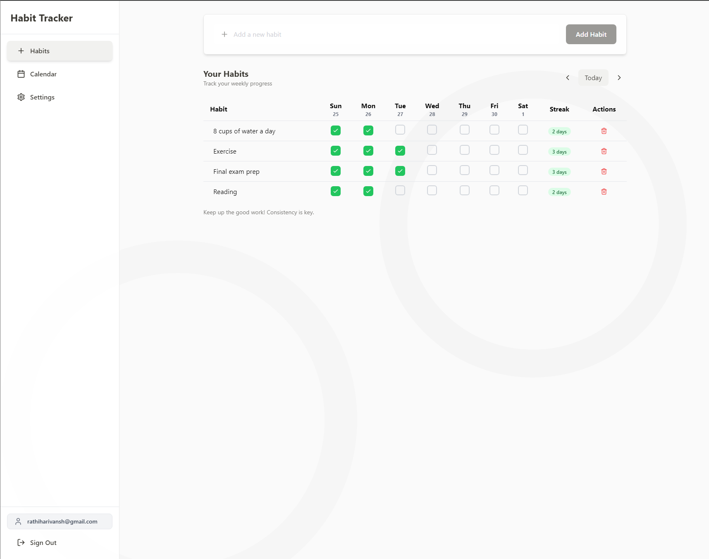
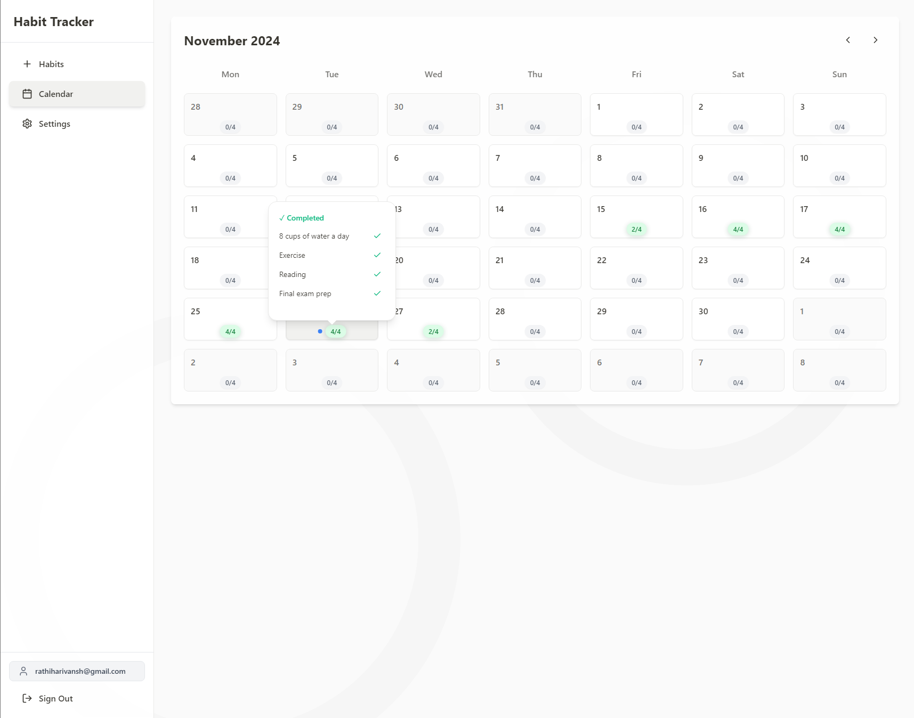
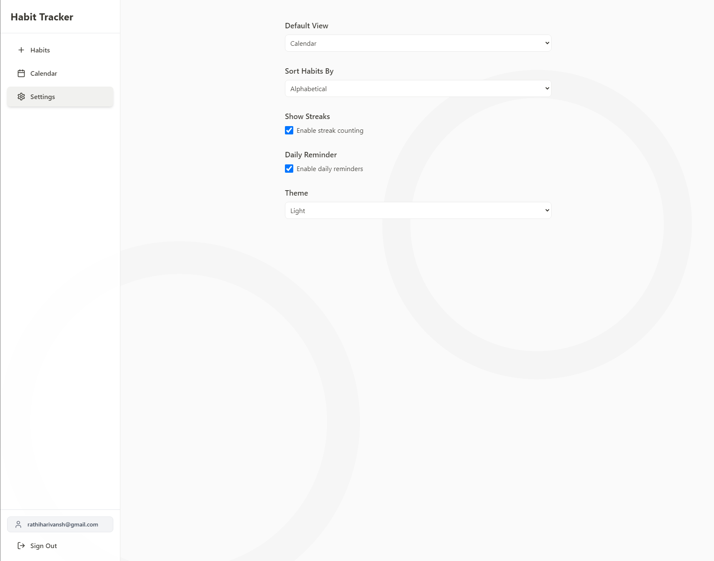

# Habit Tracker

A modern, full-stack habit tracking application built with React, TypeScript, and Supabase. Track your daily habits, visualize progress, and build better routines.

### Habits page



### Calendar page



### Settings page



## Features

- 📱 Responsive design that works on desktop and mobile
- 🌓 Light and dark mode support
- 📊 Weekly and monthly habit tracking views
- 🔄 Real-time updates using Supabase
- 📈 Streak tracking and statistics
- 🔐 User authentication and personal habit storage
- ⚡ Fast and responsive UI with Framer Motion animations

## Tech Stack

- **Frontend:**

  - React
  - TypeScript
  - Tailwind CSS
  - Framer Motion
  - Lucide Icons

- **Backend:**

  - Supabase (Database & Authentication)

- **Development:**
  - Vite
  - ESLint
  - PostCSS
  - Vercel (Deployment)

## Getting Started

### Prerequisites

- Node.js (v18 or higher)
- npm or yarn
- Supabase account

### Environment Setup

1. Clone the repository:

```
git clone https://github.com/rathiharivansh/habit-tracker-2.git
```

```
cd habit-tracker-2
```

2. Install dependencies:

```
npm install
```

3. Create a `.env` file in the root directory with your Supabase credentials:

```
VITE_SUPABASE_URL=
VITE_SUPABASE_ANON_KEY=
```

### Database Setup

1. Create a new Supabase project
2. Set up the following tables in your Supabase database:

```
-- Habits table
CREATE TABLE habits (
id BIGINT GENERATED BY DEFAULT AS IDENTITY PRIMARY KEY,
user_id UUID REFERENCES auth.users(id) ON DELETE CASCADE,
name TEXT NOT NULL,
created_at TIMESTAMP WITH TIME ZONE DEFAULT TIMEZONE('utc'::text, NOW()) NOT NULL,
best_streak INTEGER DEFAULT 0
);
-- Habit completions table
CREATE TABLE habit_completions (
habit_id BIGINT REFERENCES habits(id) ON DELETE CASCADE,
user_id UUID REFERENCES auth.users(id) ON DELETE CASCADE,
completion_date DATE NOT NULL,
PRIMARY KEY (habit_id, completion_date)
);
-- User preferences table
CREATE TABLE user_preferences (
user_id UUID REFERENCES auth.users(id) ON DELETE CASCADE PRIMARY KEY,
theme TEXT DEFAULT 'light',
default_view TEXT DEFAULT 'habits',
show_streaks BOOLEAN DEFAULT true,
habit_sort TEXT DEFAULT 'dateCreated'
);

```

### Development

Run the development server:

```
npm run dev
```

The application will be available at `http://localhost:5173`

### Building for Production

```
npm run build
```

### Deployment

The project is configured for deployment on Vercel. Simply connect your repository to Vercel and it will automatically deploy your application.

Make sure to add your environment variables in the Vercel project settings.

## Contributing

Contributions are welcome! Please feel free to submit a Pull Request.

1. Fork the project
2. Create your feature branch (`git checkout -b feature/AmazingFeature`)
3. Commit your changes (`git commit -m 'Add some AmazingFeature'`)
4. Push to the branch (`git push origin feature/AmazingFeature`)
5. Open a Pull Request

## Acknowledgments

- [Supabase](https://supabase.io/) for the backend infrastructure
- [Tailwind CSS](https://tailwindcss.com/) for the styling system
- [Lucide Icons](https://lucide.dev/) for the beautiful icons
- [Framer Motion](https://www.framer.com/motion/) for animations

## Live Demo

Check out the live demo at: [Habit Tracker Demo](https://habit-tracker-2-mhq2ufsrh-rathiharivansh-gmailcoms-projects.vercel.app/)
